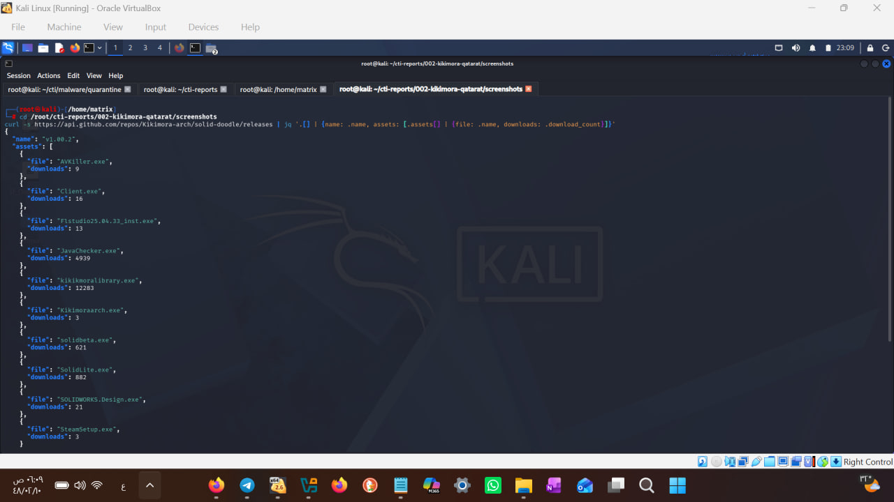
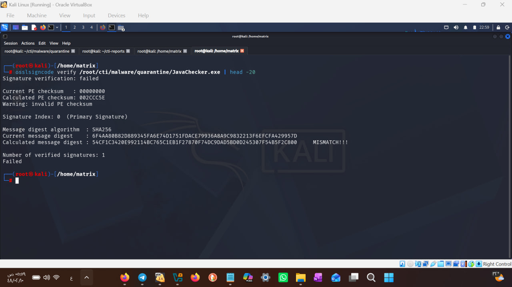

## MITRE ATT&CK Mapping

| Tactic | Technique | ID | Observation |
|--------|-----------|----|-------------|
| Resource Development | Acquire Infrastructure: Web Services | T1583.006 | Burner GitHub account, payloads in releases |
| Initial Access | Phishing: Spearphishing Link | T1566.002 | Cracked-software lures (FL Studio, SOLIDWORKS, Steam) |
| Execution | User Execution: Malicious File | T1204.002 | Victims run trojanized installers |
| Defense Evasion | Impair Defenses: Disable or Modify Tools | T1562.001 | AVKiller.exe component |
| Command and Control | Web Protocols | T1071.001 | RAT client + algorithmic backup domains |

---

# تحقيق معمق: حملة Kikimora / QatarRAT — من فيد تهديدات إلى بصمة المشغل

**تاريخ التقرير:** 21 يوليو 2026
**المحلل:** Mijlad Al-Subaie (مجلاد السبيعي) — CEH · CHFI | X: @Al7lhh223 https://x.com/Al7lhh223 · GitHub: screem500 https://github.com/screem500
**الحالة:** تحليل دفاعي — للنشر
**المنهجية:** رصد مفتوح المصدر + تحليل ساكن للعينة + استخبارات منصات (GitHub API, RDAP, CT Logs)

---

## 1. الملخص التنفيذي

انطلق هذا التحقيق من مؤشر واحد في فيد URLhaus ("QatarRAT")، وانتهى بكشف حملة توزيع متكاملة تعمل منذ فبراير 2026 عبر حساب GitHub حارق (Kikimora-arch)، حققت ما يقارب **18 ألف تحميل** عبر طعوم برامج مقرصنة (FL Studio، SOLIDWORKS، Steam)، وتضم مكونات متخصصة بينها **AVKiller** لتعطيل الحمايات وعميل RAT. التحليل الساكن كشف توقيعاً رقمياً تالفاً منتحلاً لشهادة DigiCert، ونطاقات احتياطية توليدية النمط، وبصمات لغوية تشير إلى **مشغل ناطق بالروسية** — ما يضعف فرضية "الاستهداف القطري الحصري" ويرجّح حملة إجرامية واسعة طالت الخليج ضمن أهداف أخرى.

---

## 2. الجهة المهاجمة (Attribution)

| المؤشر | الدلالة |
|--------|---------|
| اسم الحساب "Kikimora" | مخلوق من الفولكلور السلافي الشرقي |
| المستودع "solid-pomoemy" | "pomoemy" نقل صوتي للروسية (по-моему = في رأيي) |
| وصف المستودعات | "the first repo :p" / "the second rep" — أسلوب غير رسمي |

- **الاستنتاج:** مشغل ناطق بالروسية على الأرجح، يعمل في منظومة Crimeware.
- **مستوى الثقة:** متوسط (البصمات اللغوية قابلة للتزييف المتعمد — False Flag).
- **تصحيح تحليلي مهم:** تسمية "QatarRAT" في الفيدات لا تعني بالضرورة استهدافاً قطرياً حصرياً؛ قد تكون تسمية من محلل رصد ضحايا قطريين، أو تمويهاً من المشغل نفسه.

---

## 3. الخط الزمني

| التاريخ | الحدث | المصدر |
|---------|-------|--------|
| 2026-02-24 16:02 | إنشاء حساب Kikimora-arch | GitHub API |
| 2026-02-24 16:03 | إنشاء المستودع الأول solid-pomoemy (فارغ — طُعم) | GitHub API |
| 2026-02-24 16:18 | إنشاء المستودع الثاني solid-doodle | GitHub API |
| 2026-02-24 16:24 | نشر الإصدار v1.00.2 بعشرة ملفات خبيثة | GitHub API |
| 2026-06-27 | رصد JavaChecker.exe في فيدات التهديدات (QatarRAT) | URLhaus |
| 2026-07-21 | الملف ما زال متاحاً للتحميل (online) | URLhaus |

**ملاحظة:** إنشاء الحساب والمستودعين ونشر الحمولات خلال 22 دقيقة = حساب "حارق" مُعد مسبقاً لحملة واحدة.

---

## 4. مؤشرات الاختراق (IOCs)

### 4.1 البنية الأساسية
| المؤشر | النوع | التفاصيل |
|--------|-------|----------|
| github.com/Kikimora-arch/solid-doodle | حساب/مستودع | منصة التوزيع الرئيسية — نشط |
| github.com/Kikimora-arch/solid-pomoemy | مستودع | طُعم فارغ |
| fe566ca92d40914438c7ce3157a6a0936ac7be94e71e6c37b95ac84177511874 | SHA256 | JavaChecker.exe |

### 4.2 حمولات الإصدار v1.00.2 (10 ملفات)
| الملف | الحجم | التحميلات | الدور المفترض |
|-------|-------|-----------|----------------|
| kikikmoralibrary.exe | 1.4MB | **11,984** | الحمولة الأوسع انتشاراً |
| JavaChecker.exe | 2.9MB | **4,515** | QatarRAT (عينة هذا التحليل) |
| SolidLite.exe | 278KB | 882 | حمولة مساندة |
| solidbeta.exe | 33MB | 621 | حمولة بحجم برنامج شرعي |
| Flstudio25.04.33_inst.exe | 88MB | 13 | طُعم برنامج مقرصن |
| SOLIDWORKS.Design.exe | 55MB | 21 | طُعم برنامج مقرصن |
| AVKiller.exe | 60KB | 9 | **تعطيل برامج الحماية** |
| Client.exe | 30KB | 16 | عميل RAT |
| Kikimoraarch.exe | 30KB | 3 | مطابق لـ Client.exe (نفس الحجم) |
| SteamSetup.exe | 571KB | 3 | طُعم للاعبين |

**إجمالي التحميلات المرصودة: ~18,077**

### 4.3 النطاقات المستخرجة من العينة (نمط توليدي)
AspectUtilYotta.com — BlockCore.com (نشط، AWS GA) — EngineFlex.com (نشط، نفس البنية) — LogicIndexQuant.com — ManagerStella.com — SinkCoreYotta.com — UnitDelta.com — UnitSpanPolar.com

**الحالة وقت التحليل:** 2 نشطة على نفس عناوين AWS Global Accelerator (76.223.54.146 / 13.248.169.48)، و6 نائمة. يرجَّح كونها بنية احتياطية أو تشويش (ثقة منخفضة — تستحق المراقبة).

---

## 4.4 العينة الثانية: kikikmoralibrary.exe (الأوسع انتشاراً)

| البند | القيمة |
|-------|--------|
| SHA256 | 08d5960457d9cb6d825598adaa46586f42d08fd402bb2b75df44a9d12591971f |
| النوع | PE32 .NET — نفس قالب JavaChecker (builder واحد) |
| الوظيفة | **سارق توكنات** (Discord وجلسات المتصفح) — كثافة عالية من رموز Token في النصوص |
| VirusTotal | 53/70 — تسمية بارزة: MSIL.Trojan-Stealer.Penetrk.A (GData)، CrowdStrike ثقة 100% |
| وسوم VT | invalid-signature (مطابق لنتيجة التحليل المستقل)، cryp (مشفّر)، detect-debug-environment (مقاومة تحليل) |
| نطاقات مستخرجة | BaseUltra.com, HelperTerra.com, TokenKinet.com, **TokenMorph.com (نشط: 74.208.236.232 — IONOS)**, ValueQuark.com |

**ملاحظة منهجية:** نتائج التحليل الساكن المستقل (توقيع غير صالح، .NET، سارق) طابقت وسوم VirusTotal الرسمية قبل الاطلاع عليها — ما يؤكد صلاحية المنهجية المتبعة.

---

## 4.5 رصد مستقل متزامن: حملة FakeGit

في نفس يوم الرصد (2026-07-20)، التقط نظام المراقبة **5,063 رابط SmartLoader عبر raw.githubusercontent.com** — أي ما يقارب 25% من فيد URLhaus العالمي لذلك اليوم (20,119 رابطاً). بالمقارنة مع تقرير Trend Micro المنشور في 2026-07-21، تتطابق المؤشرات مع حملة **FakeGit** (7,600+ مستودع خبيث، SmartLoader ← Lumma/StealC، منسوبة لـ Water Kurita). أسماء الحسابات المرصودة تحمل نمط التوليد الجماعي نفسه (مثل 115th-discomfited211، 1342342342fsdfsdfsdfsd).

**الدلالة:** رصد مستقل متزامن لحملة عالمية في يوم الإبلاغ عنها — ويُحتمل أن تكون حملة Kikimora موجة موازية من نفس المنظومة (نمط طعوم البرامج المقرصنة ذاته).

---

## 5. نتائج التحليل الساكن (JavaChecker.exe)

| الفحص | النتيجة |
|-------|---------|
| النوع | PE32 — .NET assembly (متوافق مع عائلة Stealc) |
| التوقيع الرقمي | **يحمل توقيع DigiCert تالفاً** — فشل التحقق (Message digest MISMATCH) + PE checksum غير صالح |
| الدلالة | محاولة انتحال ثقة: شهادة منسوخة أو ملف معدّل بعد التوقيع — تخدع الفحص السطحي وتفشل أمام التحقق الفعلي |
| النصوص المستخرجة | نطاقات توليدية النمط + رموز (TokenDelta, TokenSolar, TokenChainFlow) |

---

## 6. التكتيكات والتقنيات (MITRE ATT&CK)

| التكتيك | التقنية | المعرف |
|---------|---------|--------|
| Initial Access | طعوم برامج مقرصنة (User Execution) | T1204.002 |
| Delivery | Abuse of legitimate platform (GitHub Releases) | T1105 / T1567 |
| Defense Evasion | توقيع تالف منتحل (Subvert Trust Controls) | T1553 |
| Defense Evasion | AVKiller — تعطيل الحماية (Impair Defenses) | T1562.001 |
| Execution | .NET assembly | T1059 |
| C2 (محتمل) | نطاقات توليدية النمط | T1568 |

---

## 7. السياق الخليجي

| المؤشر | الدولة | الحالة |
|--------|--------|--------|
| QA-HOST-01 (محجوب — ضحية مخترقة، بُلّغ CERT قطر) — PureLogsStealer | قطر | offline |
| omani-disputes.com — نطاق تصيد | عُمان | offline |
| louvree.abudhabe.info — Cobalt Strike C2 | الإمارات | ساقط من التسجيل (كان على شبكة اتصالات) |
| UAE-HOST-01 — Vidar | الإمارات | مخترق |
| QatarRAT عبر GitHub | تسمية قطرية | **نشط** |

---

## 8. التوصيات الدفاعية

- **حجب فوري:** الهاش والنطاقات الثمانية في أنظمة الحماية
- **سياسة مؤسسية:** منع تحميل الملفات التنفيذية من GitHub Releases غير الموثوقة — البرامج المقرصنة قناة العدوى الأولى
- **كشف:** تنبيه على أي عملية تنهي خدمات الحماية (سلوك AVKiller)
- **التحقق من التوقيعات:** لا يكفي "وجود" توقيع — يجب التحقق من صلاحيته
- **الإبلاغ:** تم/يُنصح بالإبلاغ عن المستودع عبر github.com/report-abuse (الحملة ما زالت نشطة)

---

## 9. المصادر

1. URLhaus (abuse.ch) — مؤشر QatarRAT الأصلي، 2026-06-27
2. GitHub REST API — بيانات الحساب والمستودعين والإصدارات، 2026-07-21
3. التحليل الساكن للعينة (osslsigncode, strings) — 2026-07-21
4. ThreatFox / MalwareBazaar (abuse.ch)
5. RDAP / crt.sh / dig — إثراء النطاقات

---

*إخلاء مسؤولية: تحليل دفاعي بحثي. العينة حُللت ساكناً في بيئة معزولة دون تنفيذ. المؤشرات من فيدات مفتوحة المصدر.*
