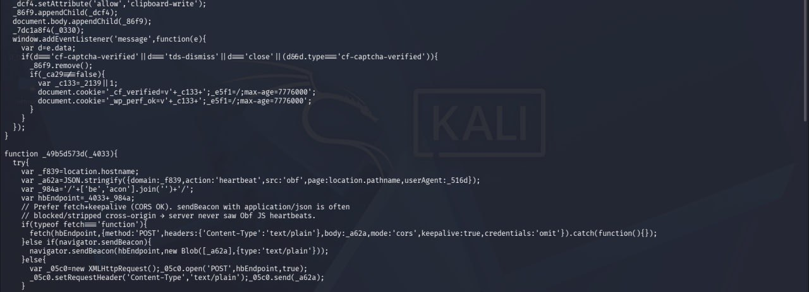
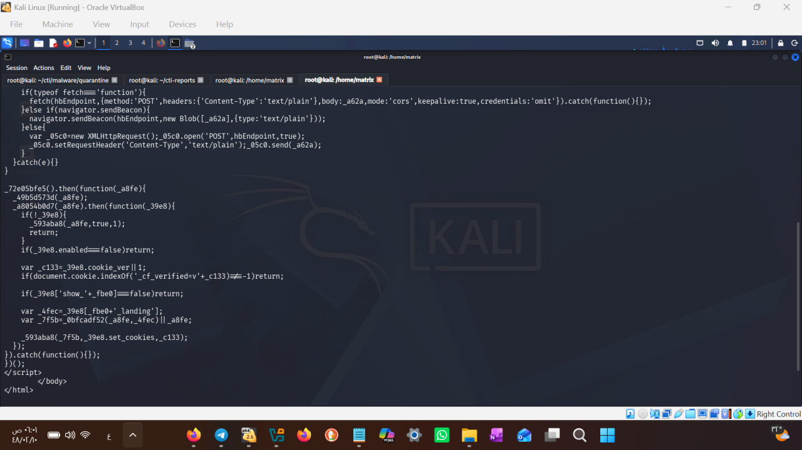

# Live Evidence: Active ClearFake Loader on a Compromised UAE Website
# دليل حي: لودر ClearFake نشط على موقع إماراتي مخترق

**التاريخ | Date:** 2026-07-24
**المحلل | Analyst:** Mijlad Al-Subaie (مجلاد السبيعي) — [@Al7lhh223](https://x.com/Al7lhh223) · [github.com/screem500](https://github.com/screem500)
الحالة | Status: تم الإبلاغ لـ aeCERT بتاريخ 2026-07-25 | Reported to aeCERT on 2026-07-25
---

## 🇸🇦 القسم العربي

### 1. الملخص

أثناء متابعة دورية لمؤشر مرصود في ThreatFox (`adminbyrequest.UAE-HOST-01.ae` — موسوم كمخترق يوزع Vidar عبر ClickFix)، تبيّن أن الصفحة تعرض محتوى نظيفاً ظاهرياً. الفحص الأعمق كشف **كود JavaScript خبيثاً مزروعاً في ذيل الصفحة** — لودر نشط من عائلة ClearFake يعمل لحظة التحليل. تم حفظ الصفحة كاملة كدليل خام (evidence/UAE-HOST-01_injected_page.html).

### 2. تحليل الكود المزروع

| العنصر | الوظيفة | الدلالة |
|--------|---------|---------|
| كوكي `_cf_verified` | علامة "تم التحقق" في جهاز الضحية | توقيع ClearFake (cf) — لا يُعرض الفخ مرتين |
| كوكي `_wp_perf_ok` | كوكي ثانٍ متخفٍّ | انتحال مظهر إضافة أداء WordPress شرعية |
| Heartbeat beacon | يرسل domain + userAgent + المسار لخادم `/beacon/` | تجسس حي على كل زائر — بياناته تصل للمشغل فورياً |
| `show_`+platform | عرض مشروط حسب نظام الضحية | استهداف انتقائي (Windows/macOS) — يفسر المظهر النظيف للفاحصين (Cloaking) |
| تعليقات المطوّر في الكود | `// server never saw Obf JS heartbeats` | الكود قيد تطوير نشط — بنية حية وليست بقايا قديمة |





### 3. لماذا بدت الصفحة نظيفة؟

اللودر يطبّق **تمويهاً شرطياً (Cloaking)**: يفحص User-Agent وسلوك الزائر، ويقدّم الفخ (تحديث متصفح مزيف) للضحايا المطابقين فقط، بينما يرى الفاحص الأمني والزاحف صفحة تسويقية سليمة لمنتج "Admin By Request" الحقيقي — وهو اختيار متعمد: اسم المنتج يجعل طلب "الصق الأمر كمسؤول" يبدو منطقياً للضحية (تقنية ClickFix).

### 4. الخلاصة والإجراء

- الاختراق **نشط وحي** وقت التحليل (2026-07-24) — لا يزال يجمع بيانات الزوار
- الشركة المالكة (UAE-HOST-01) غالباً غير مدركة للاختراق
- الإجراء: إبلاغ aeCERT بالدليل الخام + متابعة دورية لحالة الموقع

---

## 🇬🇧 English Section

### 1. Summary

During routine monitoring of a ThreatFox indicator (`adminbyrequest.UAE-HOST-01.ae` — tagged compromised, distributing Vidar via ClickFix), the page appeared superficially clean. Deeper inspection revealed a **malicious JavaScript loader injected at the page tail** — an active ClearFake-family loader, live at analysis time. The full page was preserved as raw evidence (evidence/UAE-HOST-01_injected_page.html).

### 2. Injected Code Analysis

| Element | Function | Significance |
|---------|----------|--------------|
| `_cf_verified` cookie | "Verified" marker on victim device | ClearFake (cf) signature — lure shown once |
| `_wp_perf_ok` cookie | Secondary disguised cookie | Impersonates a legitimate WordPress performance plugin |
| Heartbeat beacon | Sends domain + userAgent + path to `/beacon/` | Live visitor surveillance — data reaches the operator instantly |
| `show_`+platform | Conditional per-OS display | Selective targeting (Windows/macOS) — explains the clean appearance to scanners (Cloaking) |
| Developer comments in code | `// server never saw Obf JS heartbeats` | Actively developed code — live infrastructure, not legacy remnants |

### 3. Why Did the Page Look Clean?

The loader applies **conditional cloaking**: it inspects the visitor's User-Agent and behavior, serving the lure (fake browser update) only to matching victims, while security scanners see a legitimate landing page for the real "Admin By Request" product — a deliberate choice: the product's name makes the "paste this command as admin" step (ClickFix) appear logical to the victim.

### 4. Conclusion & Action

- The compromise was **live and active** at analysis time (2026-07-24) — still harvesting visitor data
- The owning company (UAE-HOST-01) is likely unaware
- Action: reported to aeCERT with raw evidence + ongoing monitoring of the site's status

---

## المؤشرات | IOCs

```
adminbyrequest.UAE-HOST-01.ae    (compromised — live ClearFake loader, cloaked)
76.76.21.21                     (resolving IP at analysis time)
/beacon/ endpoint               (heartbeat exfiltration path)
cookies: _cf_verified, _wp_perf_ok
```

*Raw evidence: evidence/UAE-HOST-01_injected_page.html (full page capture, 2026-07-24)*
*تحليل دفاعي بحثي — For defensive research purposes.*
